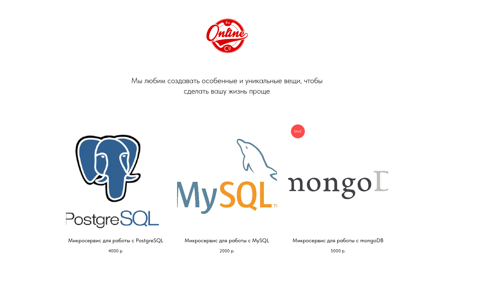

# Educational project. Microservice: sale of subscriptions

Микросервис предназначен для создания и редактирования платных подписов, оплата которых производится через yookassa.ru.

## Documentations

1. Marketing
2. [Stakeholders](./docs/01-marketing/01-stakeholders.md)
   1. [Target audience](./docs/01-marketing/02-target-audience.md)
   2. [Конкурентный анализ](./docs/01-marketing/03-concurrency.md)
   3. [Анализ экономики](./docs/01-marketing/04-economy.md)
   4. [Пользовательские истории](./docs/01-marketing/05-user-stories.md)
3. DevOps
4. Тесты
5. Архитектура

# Структура проекта
